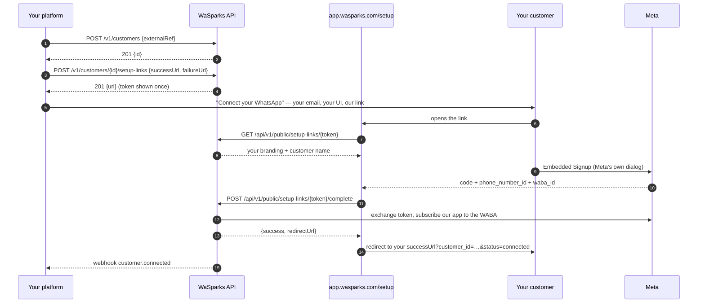

# WaSparks for platforms — partner guide

You have users who are businesses. They each want WhatsApp. You do not want to build a WhatsApp
integration, become a Meta partner, or hold anyone's access tokens.

That is what this is. You register each of your users as a **customer**, they connect their own WhatsApp
number through a link you generate, and from then on you send and receive on their behalf with one API
key. Your users never see WaSparks.

Base URL: `https://developer.wasparks.com` · Swagger: <https://developers.wasparks.com/docs>

---

## The shape of it

```
you ──── partner key ────► WaSparks ────► WhatsApp
 │                            │
 └── customer A, B, C …       └── one webhook endpoint, every customer's events
```

- A **customer** is one of your users: a business with its own WhatsApp number. It is a real tenant on
  our platform, owned by you, with no login and no email.
- Your **partner key** acts for any of them. Which one is decided by the `X-Tenant-Id` header on each
  request. Omit it and you act on your own account.
- Your **webhook endpoint** is registered once and receives every event for every customer, each
  carrying `tenantId` and `partnerId` so you can route it.
- Your **plan pools**: one allowance shared across all your customers, with an optional per-customer
  daily cap you set yourself.

---

## Quickstart

Five calls take a customer from nothing to a delivered campaign with replies coming back.

### 1. Create the customer

```bash
curl -X POST https://developer.wasparks.com/v1/customers \
  -H "X-API-Key: wsk_partner_live_YOUR_KEY" \
  -H "Content-Type: application/json" \
  -d '{
        "name": "Rahul Realty",
        "externalRef": "cust_8842",
        "contactEmail": "rahul@rahulrealty.example",
        "messagesPerDayCap": 500
      }'
```

```json
{ "id": "6d0b…", "externalRef": "cust_8842", "name": "Rahul Realty",
  "status": "ACTIVE", "cap": 500, "minDaysBetweenMarketing": 0,
  "phoneNumbers": [], "usage": { "today": 0, "month": 0 } }
```

`id` is the customer's tenant id — the value you will put in `X-Tenant-Id` from here on. Store it
against your own record.

> **Always send `externalRef`.** It is your own id for this customer, and it is what makes this call
> idempotent. A request that times out and is retried with the same `externalRef` returns the customer
> you already created (with `200` instead of `201`) rather than a second one. We reject a create without
> it for exactly that reason.

### 2. Generate a setup link

```bash
curl -X POST https://developer.wasparks.com/v1/customers/6d0b…/setup-links \
  -H "X-API-Key: wsk_partner_live_YOUR_KEY" \
  -H "Content-Type: application/json" \
  -d '{ "successUrl": "https://yourapp.example/whatsapp/done",
        "failureUrl": "https://yourapp.example/whatsapp/failed" }'
```

```json
{ "id": "9f2c…", "customerId": "6d0b…",
  "url": "https://app.wasparks.com/setup/aB3dEf9hIjKlMnOpQrStUvWxYz012345",
  "status": "PENDING", "expiresAt": "2026-09-23T09:00:00Z" }
```

Send your customer to that URL. They see **your** logo, product name and colour — no WaSparks branding
beyond a small "Powered by WaSparks" in the footer — click one button, and go through Meta's own
Embedded Signup to connect their number. When they are done we redirect them to your `successUrl` with
`?customer_id=…&phone_number_id=…&status=connected` appended.

Three things worth knowing:

- **The URL is returned once.** We store only a hash of its token, so it cannot be read back. If it is
  lost, generate another.
- **Generating a link cancels the customer's previous pending one.** Two live links would be two ways to
  connect the same number with no way to tell afterwards which was used.
- **Do not rely on the redirect alone.** Customers close tabs. The authoritative signal is the
  `customer.connected` webhook, which fires whether or not they made it back to you.

### 3. Wait for `customer.connected`

```json
{ "event": "customer.connected",
  "data": { "tenantId": "6d0b…", "partnerId": "c41a…",
            "phoneNumberId": "1234567890", "wabaId": "5678…",
            "phoneNumber": "+919876543210", "displayName": "Rahul Realty",
            "mappedVia": "ES" } }
```

The customer can now send and receive.

### 4. Save an audience, then send a campaign

Partners re-send to the same list every few days with a different template, so save the list once:

```bash
curl -X POST https://developer.wasparks.com/v1/audiences \
  -H "X-API-Key: wsk_partner_live_YOUR_KEY" \
  -H "X-Tenant-Id: 6d0b…" \
  -H "Content-Type: application/json" \
  -d '{ "name": "Sector 45 buyers",
        "members": [ { "phone": "919876543210", "vars": { "1": "Amit" } },
                     { "phone": "919876543211", "vars": { "1": "Priya" } } ] }'
```

```bash
curl -X POST https://developer.wasparks.com/v1/campaigns \
  -H "X-API-Key: wsk_partner_live_YOUR_KEY" \
  -H "X-Tenant-Id: 6d0b…" \
  -H "Content-Type: application/json" \
  -d '{ "name": "New listing – Sector 45",
        "template": { "name": "new_listing", "language": "en_US",
                      "headerMedia": { "link": "https://cdn.yourapp.example/photo.jpg" } },
        "audience": { "audienceId": "aud_7f3…" },
        "clientRef": "listing-4711" }'
```

```json
{ "id": "b21e…", "status": "DRAFT", "clientRef": "listing-4711",
  "counts": { "total": 2, "queued": 2, "suppressed": 0, "invalid": 0, "frequencySkipped": 0 },
  "quotaReserved": 2 }
```

Then `POST /v1/campaigns/b21e…/start`.

**Nothing is dropped silently.** Recipients on the customer's suppression list, those skipped by the
frequency guard and those whose number could not be parsed each get a row and a count — see
`GET /v1/campaigns/{id}/recipients?status=SUPPRESSED`.

### 5. Receive `campaign.completed` and `message.received`

```json
{ "event": "campaign.completed",
  "data": { "campaignId": "b21e…", "clientRef": "listing-4711", "tenantId": "6d0b…",
            "counts": { "total": 2, "sent": 2, "delivered": 2, "read": 1, "failed": 0, "replied": 1 } } }
```

```json
{ "event": "message.received",
  "data": { "messageId": "0191…", "wamid": "wamid.ABC", "conversationId": "44b1…",
            "contact": { "phone": "+919876543210", "waId": "919876543210", "name": "Amit" },
            "type": "text", "text": "Is it still available?",
            "receivedAt": "2026-09-16T05:20:00Z",
            "tenantId": "6d0b…", "partnerId": "c41a…" } }
```

Reply within 24 hours with an ordinary send, no template needed.

---

## The setup-link flow



An expired or already-used link renders a branded "ask {your product} for a new one" page rather than an
error. A customer who mis-clicks Meta's dialog can simply try the same link again — a failure leaves it
pending.

---

## Connecting a number directly

If a customer already has a WhatsApp Business Account and can give you a system-user access token for it,
you can skip the hosted page:

```bash
curl -X POST https://developer.wasparks.com/v1/customers/6d0b…/phone-numbers \
  -H "X-API-Key: wsk_partner_live_YOUR_KEY" \
  -H "Content-Type: application/json" \
  -d '{ "phoneNumberId": "1234567890", "wabaId": "5678…", "accessToken": "EAAG…" }'
```

Before a single row is written we make three calls to Meta with that token:

1. read the number — fails ⇒ `401 token_invalid`
2. confirm the number is in that WABA — fails ⇒ `422 number_not_in_waba`
3. subscribe our app to the WABA **and read the subscription back** — fails ⇒ `422 waba_not_shared`

Step 3 is the one that catches most attempts, and the read-back is the point: a subscribe call can report
success on a portfolio that has not shared its WABA with us, and such a number would be able to send but
would never receive a reply. **We never store a number that cannot receive replies.** If you get
`waba_not_shared`, the customer has to share their WABA with us — see the next section.

---

## Share your WABA with WaSparks

Give this to a customer that wants to connect a number directly. It takes about two minutes and is done
once per WhatsApp Business Account.

> The short version: WaSparks can only receive your incoming messages if your Business Portfolio has
> granted the WaSparks app access to your WhatsApp Business Account. Sending works without it; replies do
> not. That is why we check before connecting anything.

**Option A — Business Manager (no developer needed)**

1. Open [business.facebook.com](https://business.facebook.com) and pick the Business Portfolio that owns
   your WhatsApp Business Account.
2. **Settings → Business assets → WhatsApp accounts**, and select the account with your number.
3. Open the **Partners** tab → **Assign partner** → **Partner business ID**.
4. Enter the WaSparks business id your platform gave you, and grant **full control** of that WhatsApp
   account (or at minimum "manage" — anything less and messages cannot be sent on your behalf).
5. Tell your platform it is done. They retry the connection and it succeeds.

**Option B — Embedded Signup (does it for you)**

Ask your platform for a setup link instead. The Meta dialog that link opens performs the same grant as
part of the flow, so there is nothing to configure by hand. This is the path we recommend.

**Checking it worked.** Your platform retries the connect call. A success means Meta confirmed our app is
subscribed to your WhatsApp Business Account; there is nothing further for you to verify.

**Revoking it.** Remove WaSparks from the same **Partners** tab. Your number stops receiving messages
through us immediately, and your platform will see `customer.disconnected`.

---

## Acting for a customer

Every request that concerns one customer carries its tenant id:

```
X-API-Key: wsk_partner_live_…
X-Tenant-Id: 6d0b…
```

| Header | Effect |
|---|---|
| present, one of your customers | the request acts as that customer |
| absent | the request acts on **your own** account — your number, your campaigns |
| a tenant that is not yours | `404` |
| a customer you have suspended | `403 customer_suspended` |

A tenant that is not yours is a `404` and not a `403`, deliberately: a `403` would confirm the tenant
exists, and over enough guesses that is a directory of every business on the platform. A customer *you*
suspended is a `403`, because you already know it exists and need to be able to lift it.

Endpoints that are *about* a customer rather than performed *as* one — `/v1/customers/{id}/…` — take the
id in the path and ignore the header.

---

## Paginating a list

Every list on this API answers in the same envelope:

```json
{ "data": [ … ],
  "meta": { "next_cursor": "Mg" } }
```

Walk it by passing the previous response's `meta.next_cursor` back as `?cursor=`, and stop when
`next_cursor` is absent. `?limit=` sets the page size (default 25, maximum 100).

```bash
curl "https://developer.wasparks.com/v1/campaigns?limit=50" -H "X-API-Key: …"
curl "https://developer.wasparks.com/v1/campaigns?limit=50&cursor=Mg" -H "X-API-Key: …"
```

The cursor is opaque. Do not parse it, construct one, or do arithmetic on it — it is ours to change,
and one you build yourself is rejected rather than silently restarting the walk you thought you were
continuing.

---

## Limits

Your plan's allowance is **pooled**: one number shared by every customer plus your own account. On top of
that you may set a per-customer daily cap, which can only ever lower the effective limit:

```
effective limit = min(that customer's cap, what is left in your pool)
```

```bash
curl -X PATCH https://developer.wasparks.com/v1/customers/6d0b… \
  -H "X-API-Key: wsk_partner_live_YOUR_KEY" \
  -H "Content-Type: application/json" \
  -d '{ "messagesPerDayCap": 200 }'
```

Send `{"clearCap": true}` to remove it. A refusal tells you which limit bound:

```json
{ "error": { "code": "quota_exceeded",
             "message": "The client message quota of 200 has been used up.",
             "details": { "scope": "client", "limit": 200 } } }
```

`scope` is `client` (that customer's cap), `day` or `month` (your pool).

**Campaigns reserve their whole sendable list at once** — `total` minus suppressed, frequency-skipped and
invalid. A campaign that starts immediately reserves at create; a scheduled one reserves shortly before
it starts, because its allowance belongs to that day rather than to today. If your pool is empty when a
scheduled campaign comes due, it is **paused** rather than cancelled and you get:

```json
{ "event": "campaign.paused",
  "data": { "campaignId": "b21e…", "reason": "QUOTA",
            "quota": { "scope": "day", "limit": 20000, "required": 4000 } } }
```

Resume it tomorrow with `POST /v1/campaigns/{id}/resume`.

---

## Webhooks

Register once, receive everything:

```bash
curl -X POST https://developer.wasparks.com/v1/webhooks \
  -H "X-API-Key: wsk_partner_live_YOUR_KEY" \
  -H "Content-Type: application/json" \
  -d '{ "url": "https://yourapp.example/hooks/wasparks",
        "events": ["message.received", "campaign.*", "customer.*", "message.failed"] }'
```

Register it **without** `X-Tenant-Id`. That is what makes it a partner endpoint — one that receives events
for every customer you have. Send the header and you get an endpoint for that one customer instead, which
is occasionally what you want and usually not.

Every delivery carries `tenantId` and `partnerId`. Verify `X-WaSparks-Signature` on all of them:
`t=<unix>,v1=<hex hmac-sha256(secret, t + "." + rawBody)>`, rejecting anything whose `t` is more than five
minutes old.

| Event | When |
|---|---|
| `customer.connected` | a customer's number is connected, by link or directly |
| `customer.disconnected` | a customer's token expired — they must reconnect |
| `setup_link.expired` | a link you generated was never used |
| `message.received` | a customer's contact sent something, media included |
| `message.sent` · `.delivered` · `.read` · `.failed` | per-recipient outcomes, carrying `campaignId` and `clientRef` |
| `campaign.scheduled` · `.started` · `.paused` · `.resumed` · `.completed` · `.cancelled` | campaign lifecycle |
| `account.token_expiring` · `.token_expired` · `.quality_changed` | a customer's number needs attention |

`GET /v1/webhooks/events` returns the full list.

**Partner endpoints also receive messages your customers' staff send from the WaSparks inbox**, if you
have enabled app access for them. You are the system of record for those conversations, so a message you
could not see would be a gap in your own product. Filter on `apiKeyId` in the payload if you want only
your own traffic.

---

## Inbound media

`message.received` carries a `media.downloadUrl` valid for one hour, pointing at **our** copy of the file.
Meta's own URLs expire quickly and need an access token you do not have, so we download and store it at
receive time.

After the hour:

```
GET /v1/media/{messageId}    →    302 to a fresh signed URL
```

Follow the redirect and you have the bytes. Do not cache the redirect — the signature behind it expires.

If a fetch failed, the event carries `media.error` and no `downloadUrl`. The customer's message is still
delivered to you; only the attachment is missing.

---

## Protecting your customers' quality rating

Sending the same marketing template to the same list every few days is the fastest way to get a number
rated POOR, and a POOR number sends less. So there is a per-customer guard:

```bash
curl -X PATCH https://developer.wasparks.com/v1/partner/customers/6d0b…/settings \
  -H "Authorization: Bearer <your WaSparks session>" \
  -H "Content-Type: application/json" \
  -d '{ "minDaysBetweenMarketing": 7 }'
```

With this set, campaign creation skips any recipient who already received a MARKETING template from that
customer within seven days and reports them as `counts.frequencySkipped`. UTILITY and AUTHENTICATION
templates are never guarded. `0` (the default) is off, and the maximum is `30` — past a month it stops
being a frequency cap and becomes a suppression list.

The value in force comes back on every customer row as `minDaysBetweenMarketing`, on both
`GET /v1/customers` and the console's own list, so you never have to remember what you set.

It **fails open**: if the check cannot be evaluated the campaign sends to everyone and we log it, because
a customer unable to send at all is worse than one that over-sends once.

---

## Keys

| | Prefix | Acts on | Draws on |
|---|---|---|---|
| **Partner key** | `wsk_partner_live_` | any customer, via `X-Tenant-Id` | your pooled plan |
| **Client key** | `wsk_live_` | one customer, no header | your pooled plan, and that customer's cap |

Partner keys are created in the Partner console in WaSparks (`Partner → Keys`), never by another key — a
key that could mint its own replacement would make revoking a leaked one pointless.

Client keys are for handing a customer a credential of its own: `POST /v1/customers/{id}/keys`. They
look and behave like an ordinary WaSparks key — no `X-Tenant-Id`, no partner concepts — but they spend
**your** allowance and respect the cap you set for that customer, so the limits are the same whichever
credential the traffic arrives on. Suspending a customer stops its own key too.

(If WaSparks has put one of your customers on a plan of its own, that plan wins and the customer stops
drawing on your pool. That only happens if an administrator arranges it deliberately.)

Both count against **your** key allowance.

---

## Things that will catch you out

**`respectQuietHours` does nothing.** It is accepted on `POST /v1/campaigns` and reserved for a future
release. There is no quiet-hours engine for campaigns today. Do not rely on it to hold messages back —
schedule the campaign for the hour you want instead.

**CSV uploads expire after 24 hours.** `POST /v1/uploads/csv` returns an `uploadId`; create the campaign
the same day. An expired id is `404 upload_not_found`, and it is indistinguishable from one that never
existed because there is no upload table — the id *is* the object key.

**A customer created without a number can still be sent to.** It will fail with
`404 account_not_found`. Wait for `customer.connected`.

**Suspending a customer is immediate and total.** Sends, campaigns and audience writes on its behalf all
return `403 customer_suspended` within a minute. Its data stays; nothing is deleted.

**Meta's conversation charges are yours, not ours.** We never touch Meta billing. Our plans price our
delivery, data and compliance layer; what Meta charges for a conversation is between your customer's
WABA and Meta.

---

## Where to go next

- **Swagger** — <https://developers.wasparks.com/docs>, groups `v1` (this API) and `partner` (the console
  backend behind the Partner section in WaSparks).
- **[`quickstart.md`](quickstart.md)** — sending a single message, webhook signature verification, and
  migrating from the Meta Cloud API.
- **Partner console** — in WaSparks under **Partner**, if your account has been enabled. Everything here
  is also possible by hand there: creating customers, generating links, issuing keys, watching usage.
  It also has two views the API does not: **every customer's campaigns in one list**
  (`GET /v1/partner/campaigns`, each row carrying `customerId` and `customerName`, or
  `?customerId=self` for your own account; up to 50 customers at a time), and **a campaign's
  recipients** (`GET /v1/partner/campaigns/{id}/recipients?status=&cursor=`) so support can see exactly
  who was not sent to and why. Both are read-only and authenticated with your WaSparks session, not with
  a key. Cursors are not interchangeable between the merged list and a single customer's.
